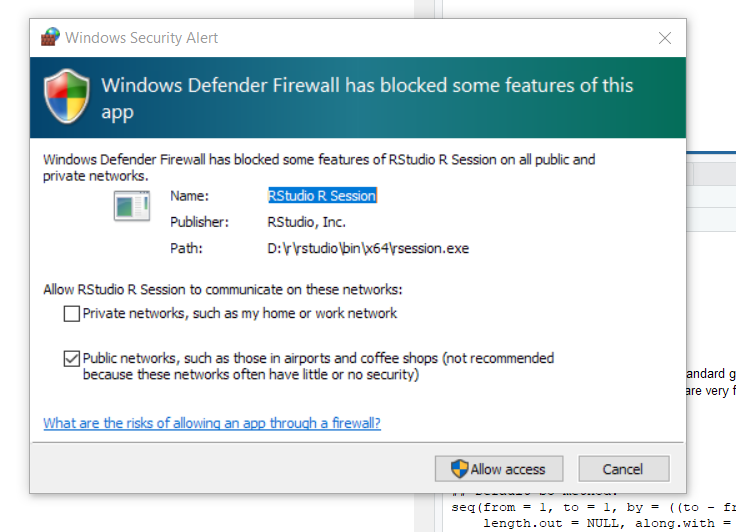

# Rady pre užívateľov Windows

Na prvej lekcii sme sa stretli s niekoľkými nepríjemnosťami, a tu sú rady ako (dúfam) väčšinu z nich odstrániť.

Prosím dajte mi __ihneď__ vedieť, ak vám stále niečo nefunguje, alebo sa objavil nový problém.

## Nejde mi nainštalovať `tidyverse` alebo iné balíky

Tento problém sa vyskytol u viacerých z vás, a je to niekoľko problémov dohromady. Prosím použite nasledujúci postup:

### 1. Odinštalujte R a RStudio.

* Cez Windowsovského správcu aplikácií odinštalujte RStudio a R.

### 2. Nainštalujte R.

* Inštalujte R, môžete použiť ten istý inštalačný súbor (alebo si ho znova stiahnite z https://cloud.r-project.org), ale __zmeňte odporúčaný adresár pre inštaláciu__, namiesto *C:\\Program Files* použite niečo ako *C:\\R*, čo nemá v názve medzery ani diakritiku. Vďaka tomu by sa vám bez problémov mali nainštalovať balíky `broom` a `hms`, potrebné pre `tidyverse`.

* Kým nainštalujete *_RStudio_*, nainštalujte `tidyverse` priamo v *_R_*:
  1. Otvorte `RGui`: Tlačidlo `Windows`, začnite písať `RGui`, kým sa neobjaví `R i386 3.6.1` a to spustite. Môžete tiež kliknúť na R v *_Start menu_* alebo dvojito kliknete na ikonu na pracovnej ploche, ak ste si ju nechali vytvoriť pri inštalácii.
  2. Na príkazový riadok napíšte `install.packages("crayon")` a stlačte ENTER. Skontrolujte, že inštalácia prebehla bez problémov.
  3. Ďalej nainštalujte samotný `tidyverse`, `install.packages('tidyverse')` a ENTER. Ak všetko pôjde dobre, o chvíľu obrazovka doroluje a na jednom z posledných riadkov by malo byť `DONE`.

### 3. Teraz nainštalujte RStudio.

* Nič nepokazíte, ak RStudio nainštalujete do rovnakého adresára ako R a nie do *_C:\\Program Files_*. Môžete použiť pôvodný inštalačný súbor, alebo si ho stiahnite znova z https://www.rstudio.com/products/rstudio/download/.
* Otvorte nastavenia firewallu svojho antivírového programu, a povoľte RStudiu komunikovať so svetom.
  - Môže sa stať, že v zozname nenájdete RStudio, pretože sa ešte nepokúsilo komunkovať navonok. V takom prípade ho buď vyhľadajte v zozname aplikácií na počítači, alebo počkajte, kým RStudio zareve, že vám nevie doinštalovať niektorý balíček.
  
* Skontrolujte inštaláciu `tidyverse`: Na príkazový riadok konzoly napíšte  `library(tidyverse)`a stlačte ENTER. Mal by sa zobraiť nevinný výpis bez červených výkrikov.
  - Ak nevidíte konzolu, lebo sa automaticky otvoril nejaký súbor, naľavo na dolnom okraji okna nájdete záložku *_Console_*. Dvakrát kliknúť.

## Nefunguje mi preview notebokov v RStudiu.

Ak časť vášho problému je, že RStudio nedokázalo nainštalovať niektoré balíčky, opravte si najprv inštaláciu R a RStudia podľa postupu v predchádzajúcej časti. To isté platí, ak sa RStudiu nepodarí úspešne nainštalovať niektorý balíček pri prvom spustení `Preview`.

### 1. Vymažte a znova si stiahnite súbory .Rmd z repozitára kurzu https://github.com/PKvasnick/RTutorial, podadresár *_code_*.

* V týchto súboroch som zmenil kódovanie z UTF-8 na ISO-8859-2.
* Bol by som rád, keby ste sa pokúsili použiť *_GitHub Desktop_*.
  1. Stiahnite si GitHub Desktop a spustite ho.
  2. Pre stiahnutie súborov tutoriálu si nemusíte vytvárať konto, dajte __Skip this step__ namiesto prihlasovania. Neskôr si ale konto určite vytvorte, budete ho potrebovať, aby ste mi mohli sprístupniť vypracované zadanie ku skúške.
  3. Zadajte meno a e-mail. Nikam sa neodošlú, potrebuje ich git aby mohol označiť vaše commity (ktoré sa zatiaľ nechystáte robiť).
  4. Z troch možností vyberte tú úplne vpravo, *_Clone repository_*.
  5. Nie *_GitHub.com_*, ale zase možnosť úplne vpravo, *_URL_*.
  6. Ako URL stačí zadať `PKvasnick/RTutorial`, a v nasledujúcom poli môžete zvoliť iné umiestnenie pre súbory.
  7. Ak všetko dobre dopadne, uvidíte prázdne okno, pretože ste zatiaľ neurobili žiadne zmeny v kóde. Ale súbory sú namieste na vašom disku a aplikácia bude pozorne sledovať zmeny, ktoré v nich urobíte.
* Ak otvoríte niektorý z notebookov v RStudiu, zase sa vám znaky nezobrazia správne. Zvoľte *_File / Reload with encoding...  _* a zo zoznamu vyberte `ISO-8859-2`. __Zaškrtnite aj políčko dolu__, že chcete, aby sa toto kódovanie používalo ako štandardné.
* Tým by mali byť vaše problémy vyriešené.
  - Mali by sa vám správne zobraovať znaky v editore.
  - Keď stlačíte Preview, RStudio prehlási, že chce doinštalovať niekoľko balíčkov. Povoľte a skontrolujte, že nikde nedošlo k chybe. Ak áno, v lepšom prípade pomôže skontrolovať nastavenia firewallu, v horšom zopakujte inštaláciu, a ak ste to práve urobili a nepomohlo, napíšte mi.
  - Mal by vám fungovať aj `knitr` (tiež bude chcieť čo-to doinštalovať) a mal by vyrábať správne PDF súbory.
* `knitr` vám môže prepísať hlavičku .Rmd súboru, a môže do nej napísať znaky v nesprávnom kódovaní. Ak by sa to stalo, sú na tom dobre tí, ktorí použili GitHub Desktop. Tým stačí prejsť do GitHub Desktopu, kliknúť pravým tlačítkom na prísušný súbor v zozname naľavo, a vybrať `Discard changes`. Súbor sa nahradí svojou pôvodnou verziou.
