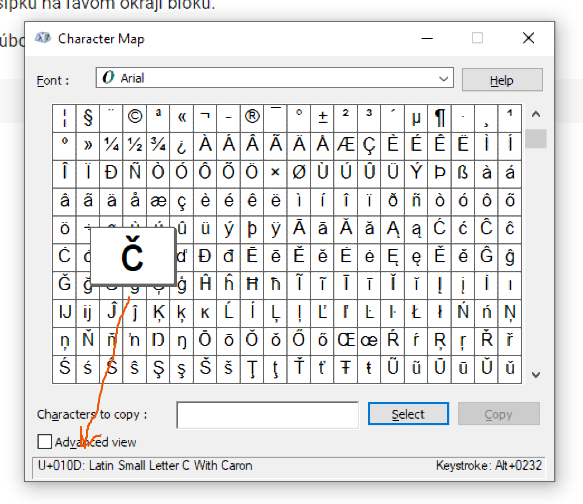

# Ako chutí R

Kým začnete písať R, urobíme niečo jednoduché, aby ste mali predstavu, kade povedú naše ďalšie kroky.

## R notebook
Nachádzame sa v R-Markdown notebooku. Notebook pozostáva:

* z YAML hlavičky, ktorá obsahuje základné informácie o dokumente a jeho spracovaní

* z textu, ako je tento, s Markdown formátovaním

* z blokov kódu, ohraničených troma *backtickmi*. *Backtick* je opačný apostrof a na klávesnici sa spravidla nachádza na klávese *~/;* vľavo hore pod Esc. *Nie je to apostrof!*

* z blokov výstupu, obsahujúcich textový a grafický výstup kódu z predchádzajúceho poľa. 

Tento notebook je iný ako Google Colab notebook, s ktorým ste sa stretli na minulej hodine. 

Predovšetkým musíte mať vlastnú inštaláciu R a R studia na svojom počítači. S Google Colab notebookom ste používali inštaláciu R na serveroch Googlu a vašim vývojovým protredím bola Javascriptová aplikácia, bežiaca vo vašom prehliadači. 

Pre podrobnejšie informácie o organizácii RMarkdown notebooku si môžete pozrieť napríklad tento
[RMarkdown guide](https://rmarkdown.rstudio.com/lesson-1.html) na stránkach R-Studia.

Pre všeobecný úvod do markdownu odporúčam návody na GitHube, hlavne  [Mastering Markdown](https://guides.github.com/features/mastering-markdown/)

V Google Colab notebooku ste mali textové bunky, tu vidíte skôr markdown, v ktorom sa nachádzajú bunky s kódom. Markdown v textových bunkách sa rendroval hneď po opustení bunky, zatiaľčo RMarkdown notebook musíte rendrovať naraz kliknutím na __Preview__ alebo __Knit__ na hornom paneli okna (alebo stlačením __Ctrl-Shift-K__). Môžete nastaviť, kde sa má zobraziť vyrendrovaný dokument a či to má byť html, pdf alebo Word.

Poďme študovať kód v našom notebooku, napríklad tuto máme prvú bunku:

```{r}
plot(cars)
```

Kód v poli vykonáme stlačením __Ctrl-Shift-Enter__ alebo kliknutím na zelený trojuholníček (*Run current chunk*) vpravo hore v poli kódu.


## Ukážkové dátové súbory v R

Zjavne sme niečo nakreslili, ale čo je `cars`?

Je to ukážkový dátový súbor, ktorý máte k dispozícii spolu so základnými balíčkami v každej inštalácii R. 

__Recept__ Keď v R niečo stretnem a neviem čo to je, prvá vec, ktorú skúsim, je `help(cars)`, __Ctrl-Enter__ pre spustenie, a kuk doprava, kde sa zobrazil panel s vysvetlením.

Aha, takže mám výsledky merania brzdnej dráhy v závislosti od počiatočnej rýchlosti vozidla spred 100 rokov. Všimnite si, ako help dokumentuje obsah polí. 

### Parametre kódových polí
Ešte sme sa tiež naučili, ako vyzerá blok kódu v RMarkdown notebooku: 

````markdown
`r ''````{r}
plot(cars)
```
````
__Poznámka:__ 
V zdrojovom mardowne tejto časti môžete vidieť čudné štruktúry so štyrmi backtickmi. Nemusíte si ich všímať - nie sú na výstupe vidieť, a slúžia mi len na zobrazenie bloku kódu v texte - teda na zabezpečenie, aby sa táto časť kódu nevykonala, iba zobrazila. 

__Úloha:__
Vytvorte takýto blok kódu a vykonajte ho. 

````markdown
`r ''````{r echo=FALSE}
plot(cars)
```
````

Parametrov kódového bloku je viac a môžete nimi riadiť vykonávanie kódu.

    * include = FALSE zabráni, aby sa kód alebo výsledky objavili vo výslednom súbore. R Markdown ale vykoná kód v bloku, takže jeho výsledky môžu využiť iné bloky. 
    * echo = FALSE zabráni, aby sa kód objavil vo výslednom súbore, zobrazia sa ale výsledky. Takto môžete ľahko vkladať obrázky. 
    * message = FALSE zabráni zobrazovaniu správ, generovaných kódom, vo výslednom dokumente. 
    * warning = FALSE zabráni zobrazovaniu varovaní, generovaných kódom, vo výslednom dokumente.
    * fig.cap = "..." pridá legendu k vytvorenému obrázku (hodí sa iba pre určité účely)

V dokumentácii k RMarkdownu nájdete ďalšie možnosti. 

Poďme sa teda pozrieť, ako vyzerajú dáta `cars`.

```{r}
head(cars, 4)
```

`head` zobrazí iba niekoľko prvých riadkov tabuľky. Používame automaticky preto, lebo keby ste mali veľké dáta, mohol by sa váš počítač na dlhú chvíľu zamyslieť, kým by vám na displeji vyroloval 2 gigabajty čísel. Bežne chceme vidieť hlavičku a pár prvých riadkov. 

__Úloha__ 
Toto je malý dátový súbor a tak si môžete zobraziť všetky dáta. Vytvorte blok kódu s jediným príkazom `cars` a vykonajte ho. 

```{r}
cars
```

## R data frame

Vidíme tabuľku, ľahko zistíme, že má `r nrow(cars)` riadkov a `r ncol(cars)` stĺpce.

* Stĺpec úplne vľavo sa nepočíta, nemá meno a budeme ho nazývať *index*. Automaticky ho vytvorilo R a slúži na jednoznačné označenie riadkov v tabuľke. * *Riadky* zodpovedajú jednotlivým prípadom, pacientom, vzorkám a pod. 
* *Stĺpce* zodpovedajú vlastnostiam prípadov, pacientov, vzoriek.

Toto je typický spôsob usporiadania dát pre štatistickú analýzu (nielen v R) a vynaložíme pomerne veľa času, aby sme sa naučili svoje dáta takto usporiadať. 


## Aká to je závislosť?

Tak máme nejaké dáta, a čo to je za závislosť?

```{r}
plot(cars)
```

__Úloha:__: Ako uložíme obrázok do súboru? (Nápoveď: Spýtajte sa Googlu)


```{r}
png("CarPlot.png")
plot(cars)
dev.off()
```

*Tip*: 
Ak sa notebook začne chovať čudne, vždy pomôže __Session -> Restart R__, pričom si môžete vybrať, čo sa má stať po reštarte.

Poďme to nakresliť poriadne. 

```{r}
plot(cars, xlab = "Speed [mph]", ylab = "Stopping distance [ft]", las = 1)
lines(lowess(cars$speed, cars$dist, f = 2/3, iter = 3), col = "red")
title(main="Stopping distance vs. initial speed")
```

__Úloha__: Kto netuší, čo je *lowess*, čo spraví?

__Recept__: stĺpce dátovej tabuľky sú `data$<meno_stlpca>`

Naša závislosť vyzerá ako parabola, tak si ju nakreslíme v logaritmickej škále:

```{r}
plot(cars, xlab = "Speed [mph]", ylab = "Stopping distance [ft]", las = 1, log = "xy")
lines(lowess(cars$speed, cars$dist, f = 2/3, iter = 3), col = "red")
title(main="Stopping distance vs. initial speed, log-log scale")
```

__Úloha__: Funguje slovenská diakritika? Skúste poslovenčíť popisy v grafe.

```{r}
plot(cars, xlab = "Po\U010Diato\U010Dná rýchlosť [míle / hod]", ylab = "Brzdná dráha [stopy]", las = 1, log = "xy")
lines(lowess(cars$speed, cars$dist, f = 2/3, iter = 3), col = "red")
title(main="Brzdná dráha v závislosti od počiatočnej rýchlosti, log-log škála")
```

Diakritika funguje inline v notebooku, ale nie vo vyrendrovanom dokumente. To teraz nejdeme riešiť. 

* Rýchle riešenie je nahradiť znaky, ktoré sa zle zobrazujú, ich kódmi Unicode. Napríklad v našom prípade namiesto znaku "č" treba vložiť "\U010D", a problém je vyriešený, podobne možno nahradiť iné problematické znaky. 
* Ako vidíte, normálny text sa rendruje správne, takže problém sa väčšinou týka niekoľko málo znakov. 
* Je tiež možné doladiť nastavenia kódovania a fontov v RStudiu, aby sa problémy vyriešili, ale nejdem s tým strácať čas. Tento problém balíka `knittr` je známy a kým sa R naučíte, najskôr nebude existovať.



Tu už naša závislosť vyzerá ako priamka, tak to skúsme fitnúť. 

__POZOR__ začína štatistika!

```{r}
fmL <- lm(log(dist) ~ log(speed), data = cars)
summary(fmL)
plot(fmL)
```

Máme tu kopu výstupov.

Z textového výstupu vidíme, že máme celkom dobrý model $d = e^{-0.73}v^{1.6}$

*Tip* 
Ešte vidíme, že môžeme písať aj vzorce v TeX-ovej notácii, buď do riadku, napríklad $\sigma^2=E(X^2) - E(X)^2$ alebo samostatne, napríklad
$$
\chi^2(\mathbf{z}) = \frac{1}{n}\sum^n_{i=1}z_i^2
$$

Výsledkom nášho programovacieho úsilia môže byť report, ktorý zobrazíme záverečným kliknutím na __Preview__ alebo __Knit__ (alebo __Ctrl-Shift-K__). Markdown nám umožňuje jednak vyrendrovať náš dokument do niekoľkých formátov, ale aj použitím príslušných tém vytvoriť napríklad slajdy či brožúru.

Systém práce v RStudiu je dvojfázový:

 * Najprv postupne píšem dokument a po krokoch odladím kód, aby počítal, čo treba.
 * Nakoniec dokument vyrendrujem do požadovanej výslednej podoby. 

__Úloha__: Vyhľadajte si na Googli všetko, čomu nerozumiete. Alebo sa spýtajte.

__Úloha__: Čo keby som vo výstupe nechcel R-kód? 

__Úloha__: Skúste svoj report vyrendrovať do pdf.

