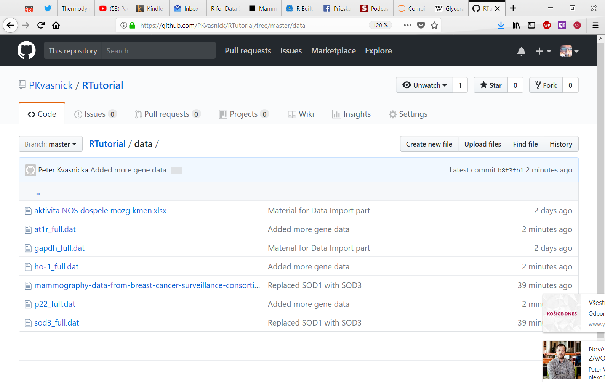
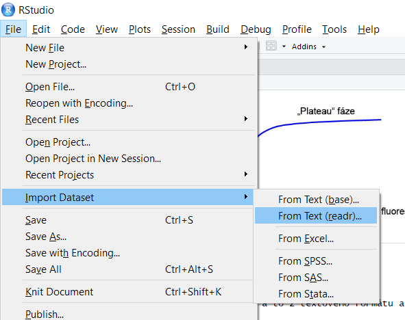
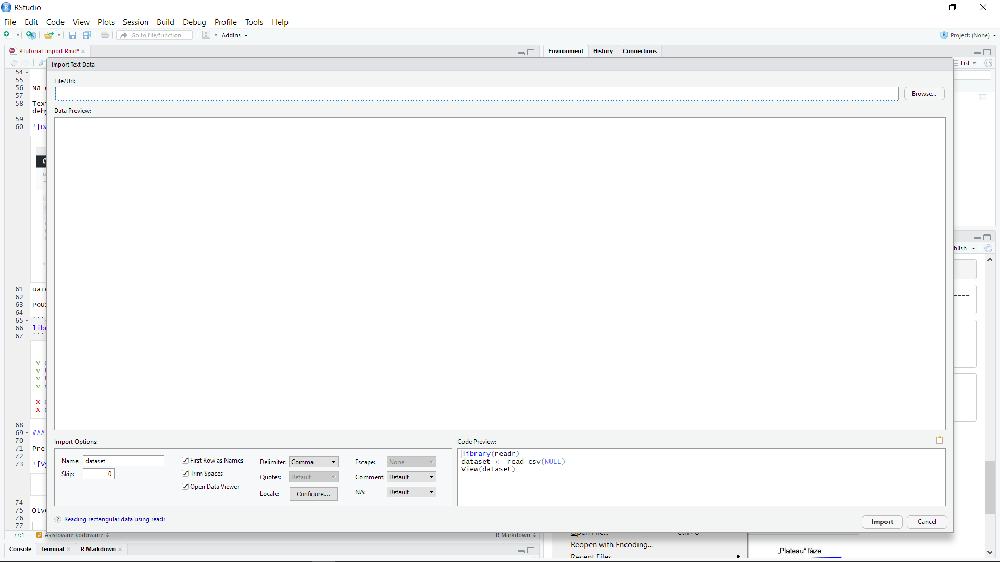
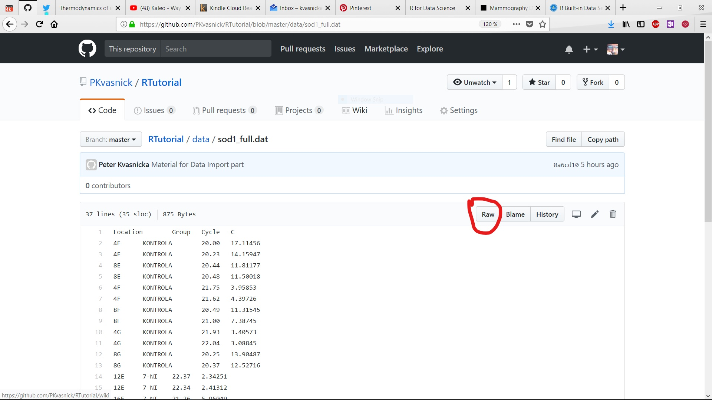
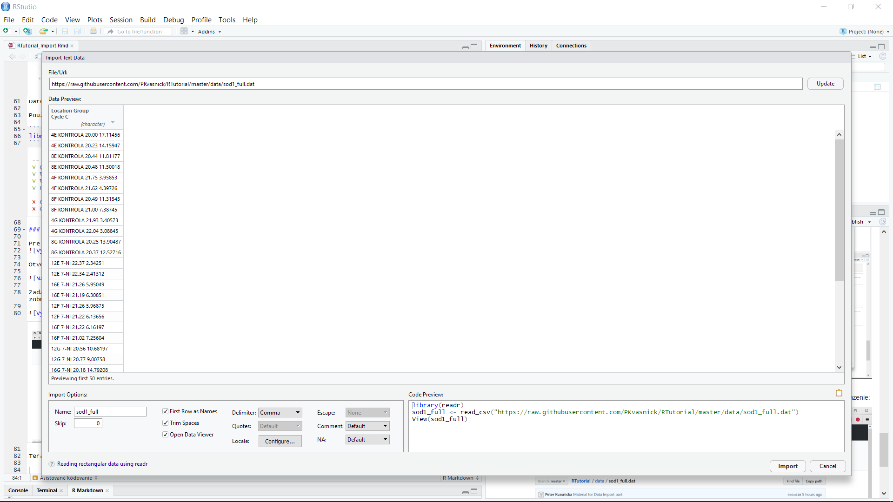
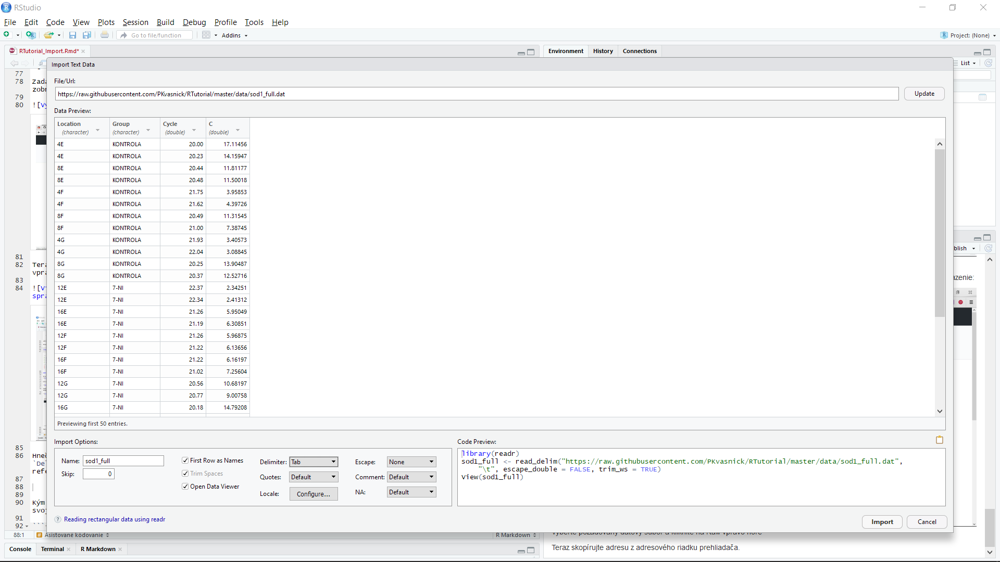

Import dát do R
========================================================


Minule sme sa venovali základom R a vizualizácii.

Dnes sa pokúsime dosta» do R nejaké dáta a upravi» ich do použiteµnej podoby.

Dáta pre R
========================================================

R doká¾e naèíta» dáta z najrozmanitej¹ích zdrojov.

My sa budeme zaobera» troma:
- textové súbory
- MS Excel
- JSON (JavaScript Object Notation)


### RT-PCR

Pou¾ijeme dáta z analýzy expresie génov redoxnej ochrany.

Pod expresiou rozumieme rýchlos», s akou sa syntetizuje daný gén. Meriame ju pomocou real-time PCR (tie¾ qPCR, kvantitatívna PCR) ako mno¾stvo mRNA obsahujúcej sekvenciu príslu¹ného génu (alebo jej charakteristickú èas»)

Veµmi struène o RT-PCR (podrobnej¹ie napríklad tu: http://labguide.cz/metody/real-time-pcr/):

* Oznaèíme ¹pecifickými syntetickými markermi sekvenciu pre daný gén.

* Poèas opakujúcich sa teplotných cyklov dochádza k multiplikácii tohoto úseku. 

* Nárast je spoèiatku exponenciálny, potom prechádza do saturácie, ako postupne ubúda substrát pre syntézu nových replík

* Závislos» mno¾stva syntetizovanej DNA od èasu má teda esovitý charakter.

* Dosiahnuté plató nesúvisí s poèiatoèným mno¾stvom ¹tudovanej sekvencie vo vzorke.

* Mierou mno¹tva je cyklus, v ktorom exponenciálny nárast prejde do lineárneho.


Import textových dát
========================================================

Na dátach z RT-PCR si vyskú¹ame import, a to z textového formátu a z Excelu.


Textové súbory pre gén superoxid-dismutázy 3 (SOD-3, extracelulárna, tetramérna) a pre referenèný, *housekeeper* gén glyceraldehyd-3-fosfát dehydrogenázu (GAPDH) nájdete v repozitári kurzu, https://github.com/PKvasnick/RTutorial/tree/master/data.


Dátové súbory si nemusíte s»ahova», mô¾ete ich importova» priamo z GitHubu.

Pou¾ijeme balíky `tidyverse`, tak ako v naposledy.

```{r}
library(tidyverse)
```

### Asistované kódovanie

Pre naèítanie súboru vyu¾ijeme nástroj na import dát, ktorý ponúka *RStudio*. Tento nástroj nám toti¾ pomô¾e doladi» parametre pre naèítanie a získa» kód, ktorým sa naèítanie vykoná. 



Otvorí sa nástroj pre import. 



Zadajme adresu súboru v repozitári na GitHube. Aby sme získali správnu adresu, musíme prejs» na súbor a zvoli» raw zobrazenie:



Teraz skopírujte adresu z adresového riadku prehliadaèa a vlo¾te ju do príslu¹ného poµa v importéri. Stlaète `Update` vpravo od poµa a uvidíte náhµad dát.



Hneï vidíme, ¾e dáta sa nerozdelili do ståpcov. Je to preto, ¾e máme zle nastavený oddeµovací znak. Nastavte v poli `Delimiter` na `Tab` a v¹etko sa napraví. Takisto potrebujeme zada» názov dát, preto¾e budeme importova» ïal¹iu pre referenciu (GAPDH).



Kým kliknete na `Import`, v¹imnite si, ¾e v poli vpravo dolu máme kód, ktorý sa vykoná. Ten si mô¾eme okopírova» do svojho skriptu a pritom sa pouèi», ako taký príkaz vyzerá.

```{r}
sod3.data <- read_delim("https://raw.githubusercontent.com/PKvasnick/RTutorial/master/data/sod3_full.dat", 
    "\t", escape_double = FALSE, trim_ws = TRUE)
```

a ako sna¾iví úèastníci kurzu samozrejme hneï spú¹»ate `help(read_delim)`, resp. `?read_delim`, aby ste sa dozvedeli viac.

__Úloha__: Overte, èo robí príkaz `view(sod3.data)`.
__Úloha__: Skontrolujte, ¾e naèítanie prebehlo správne.

Znakové polia a faktory
=============================================================

```{r}
gapdh.data <- read_delim("https://raw.githubusercontent.com/PKvasnick/RTutorial/master/data/gapdh_full.dat", 
    "\t", escape_double = FALSE, trim_ws = TRUE)
print(gapdh.data)
```

A teraz tomu vytneme:

```{r}
sod3.data$Cref <- gapdh.data$C
sod3.data$LogRat <- log10(sod3.data$C / sod3.data$Cref)
print(sod3.data)
ggplot(data = sod3.data) + 
  geom_boxplot(mapping = aes(x = Group, y = LogRat, color = Group)) + 
  geom_jitter(mapping = aes(x = Group, y = LogRat, color = Group))
```

Ups. Asi potrebujeme iné dáta, tieto sú o¹klivé.

Ako vidno, tieto polia vlastne neobsahujú znakové re»azce, ale obsahujú informáciu o dvoch klasifikáciách: 

* __terapeutickej skupine__ (èi vzorka pochádza od potkana, ktorý patril do kontrolnej skupiny, alebo do skupiny, ktorej bol podávaný 7-nitroindazol 7-NI, resp. metylester N-L-nitroarginínu, L-NAME). 7-NI aj L-NAME sú inhibítory tvorby oxidu dusnatého (NO) v tkanivách.

* __zvierati__ / vzorke. Oznaèenia sú v skutoènosti oznaèenia na meracej platnièke, ale je dôle¾ité vedie», ktoré merania spolu súvisia.

Inak povedané, musíme R oznámi», ¾e tieto dva ståpce obsahujú dáta, ktoré vyjadrujú nie nezávislú textovú informáciu, ale informáciu o príslu¹nosti riadku do niektorej klasifikaènej skupiny. Inak povedané, musíme tieto riadky premeni» na __faktory__.

```{r}
sod3.data$Location = as.factor(sod3.data$Location)
sod3.data$Group = as.factor(sod3.data$Group)
sod3.data
```
```{r}
sod3.data$Group = relevel(sod3.data$Group, ref = "KONTROLA")
print(sod3.data$Group)
```